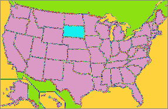
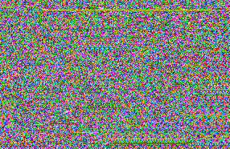

# SDES-BMP

_Joel Byers & Dylan Miller_

_CSC-487_

## Description
This project includes two main executables: `SDES_BMP_ECB.cpp` and `SDES_BMP_CBC.cpp`. These program scan be used to encrypt and decrypt a .bmp image using SDES encryption. `SDES_BMP_ECB.cpp` does this using Electronic Code Book (ECB) and `SDES_BMP_CBC.cpp` uses Cipher Block Chaining (CBC).

## Building
**Both programs depend on SDES.cpp.**

To build `SDES_BMP_ECB`, use:

```
g++ SDES_BMP_ECB.cpp SDES.cpp -o sdesEcb.out
```

To build `SDES_BMP_CBC`, use:

```
g++ SDES_BMP_CBC.cpp SDES.cpp -o sdesCbc.out
```

## Running
Both programs have the same command line arguments:
* Input file
* Output File
* 'e' or 'd' (encrypt or decrypt)

example:
```
./sdesCbc input.bmp output.bmp e
```

## ECB vs CBC
Electronic Code Book encrypts the data byte by byte. This results in images with different coloration, but preserves the shape of the image.




Cipher Block Chaining uses the previous byte to encrypt the current one, meaning that a byte isn't just isolated in the encryption process. Instead, it's influenced by another source of varrying This results in an image that is undestinguishable.

